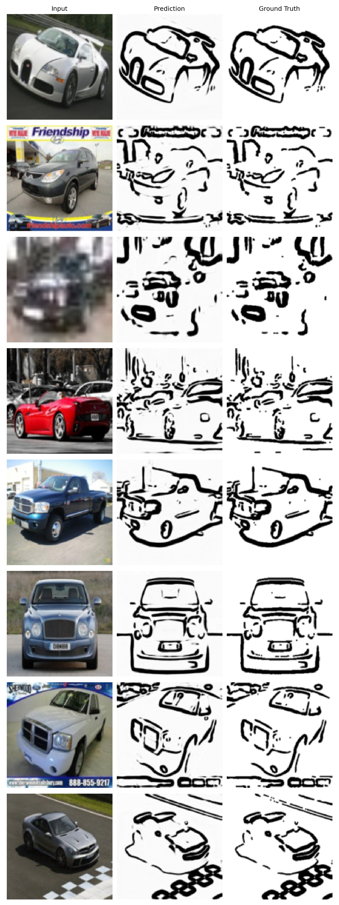

# Line Art Generator — Category-Based Pipeline

A deep learning pipeline that converts photographs into stylised **line art drawings**, guided by semantic category. Given an input photo, the system first classifies it into one of three categories (biological, building, or vehicle), then applies a dedicated U-Net generator trained for that category's visual style.

---

## Pipeline Overview

```
Input Photo ──▶ ResNet-18 Classifier ──▶ U-Net (Bio / Bld / Veh) ──▶ Line Art
```

| Stage | Model | Details |
|---|---|---|
| Classification | ResNet-18 (pretrained) | 3-class head, 98.78% test accuracy |
| Generation (Bio) | U-Net from scratch | Channels: 3→32→64→128→256→512 |
| Generation (Bld) | U-Net from scratch | Weighted BCE + L1 loss |
| Generation (Veh) | U-Net from scratch | 128×128 input, 30 epochs |

---

## Results

### Classification

| Model | Overall | Biological | Building | Vehicle |
|---|---|---|---|---|
| Baseline CNN | 84.56% | 84.00% | 79.33% | 90.33% |
| **ResNet-18** | **98.78%** | 99.67% | 97.33% | 99.33% |

### Line Art Generation (U-Net with edge-detection targets)

| Category | Test Loss | Dice | IoU |
|---|---|---|---|
| Biological | 0.337 | 0.981 | 0.962 |
| Building | 0.332 | 0.979 | 0.958 |
| Vehicle | 0.309 | 0.983 | 0.967 |

### Sample Outputs

Input → Prediction → Ground Truth



---

## Repository Structure

```
.
├── scripts/
│   ├── prepare_classification_data.py   # Download & split classification dataset
│   ├── generate_xdog_targets.py         # Generate edge-detection line art targets
│   ├── train_classifier.py              # Train baseline CNN + ResNet-18 classifier
│   └── train_lineart.py                 # Train category-specific U-Nets
├── outputs/
│   ├── baseline_cnn/                    # Curves, confusion matrix, results
│   ├── resnet18/                        # Curves, confusion matrix, results
│   ├── unet_biological/                 # Curves, samples, results (model excluded)
│   ├── unet_building/
│   └── unet_vehicle/
├── web/
│   └── index.html                       # Frontend (drag-and-drop UI)
├── app.py                               # Flask backend API
├── report/
│   ├── progress_report.tex              # LaTeX progress report (ICLR template)
│   ├── references.bib
│   ├── iclr2025_conference.sty
│   └── figures/                         # All figures used in the report
└── README.md
```

---

## Setup

### Requirements

```bash
pip install torch torchvision flask pillow numpy matplotlib
```

> Tested with Python 3.12, PyTorch 2.x. MPS (Apple Silicon) supported.

### 1. Prepare Classification Data

```bash
python scripts/prepare_classification_data.py
```

Downloads iNaturalist 2021 (biological), Places365 (building), and Stanford Cars (vehicle).
Outputs 2,000 images per class split 70/15/15% into `dataset_classification/`.

### 2. Generate Line Art Targets

```bash
python scripts/generate_xdog_targets.py
```

Applies multi-scale gradient edge detection (Sobel at σ ∈ {1, 2, 4}) with per-category parameters to classification images, producing spatially-aligned black-on-white line art targets in `dataset_lineart/`.

### 3. Train the Classifier

```bash
python scripts/train_classifier.py
```

Trains both the baseline CNN and ResNet-18 classifier. Outputs saved to `outputs/baseline_cnn/` and `outputs/resnet18/`.

### 4. Train the U-Net Generators

```bash
python scripts/train_lineart.py --epochs 30 --batch_size 16 --img_size 128
```

Trains one U-Net per category. Saves best model weights, loss/Dice/IoU curves, and sample prediction grids to `outputs/unet_{category}/`.

### 5. Run the Web Demo

```bash
python app.py
```

Open `http://localhost:5000` in your browser. Drag and drop any image to classify it and generate line art.


---

## Architecture Details

### Classifier — ResNet-18

- Pretrained on ImageNet; final FC replaced with 3-class head
- Fine-tuned end-to-end with Adam (lr=1e-4), batch size 32
- Early stopping (patience=6), ReduceLROnPlateau scheduler
- ~11.2M parameters

### Generator — U-Net (per category, ~7.8M parameters)

```
Encoder:
  Input (3, 128, 128)
  DoubleConv → 32 channels  + MaxPool
  DoubleConv → 64 channels  + MaxPool
  DoubleConv → 128 channels + MaxPool
  DoubleConv → 256 channels + MaxPool
  Bottleneck → 512 channels

Decoder (with skip connections):
  ConvTranspose + DoubleConv → 256 channels
  ConvTranspose + DoubleConv → 128 channels
  ConvTranspose + DoubleConv → 64 channels
  ConvTranspose + DoubleConv → 32 channels
  1×1 Conv + Sigmoid → 1 channel (line art)
```

**Loss function:**
```
L = WeightedBCE(w_fg=5) + L1
```
The foreground weight (×5) compensates for the severe class imbalance: line pixels are typically <10% of the image.

---

## Data Sources

| Category | Source | Size |
|---|---|---|
| Biological | [iNaturalist 2021](https://www.inaturalist.org/) (Animalia kingdom) | 2,000 images |
| Building | [Places365](http://places2.csail.mit.edu/) (20 architecture scene types) | 2,000 images |
| Vehicle | [Stanford Cars](https://huggingface.co/datasets/Paulescu/stanford_cars) (HuggingFace) | 2,000 images |

Datasets are not included in this repository due to size. Run `prepare_classification_data.py` to download them.

---

## Notes on Design Choices

- **Why category-specific U-Nets?** Different subjects have distinct line art styles: organic curves for animals, straight geometric edges for architecture, mechanical contours for vehicles. A single universal model cannot capture these distinctions.
- **Why edge-detection targets?** We initially experimented with [Sketchy Database](http://sketchy.eye.gatech.edu/) human sketches, but found they are not spatially aligned with photographs. This causes U-Nets (which assume pixel-level correspondence) to produce blurry gray blobs. Multi-scale gradient edge detection produces spatially aligned targets that enable effective pixel-level training.
- **Why weighted BCE?** Line pixels constitute <10% of target images. Without reweighting, the model learns to predict all-white, achieving low loss but zero meaningful line prediction.

---

## Course

APS360 — Applied Fundamentals of Deep Learning  
University of Toronto, Winter 2026
